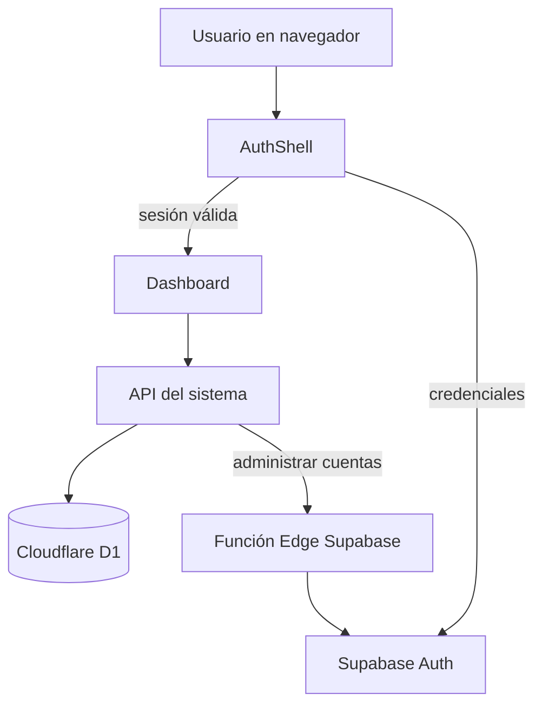

# Arquitectura del sistema

## Vista general

El navegador muestra una interfaz React. Todas las lecturas y escrituras del negocio pasan por rutas API del mismo proyecto; la interfaz nunca se conecta directamente a D1 ni administra usuarios con privilegios elevados.

## Flujo de una lectura

1. `AuthShell` pregunta a `/api/auth/session` si existe una sesión.
2. `Dashboard` solicita `/api/system` con `GET`.
3. La API valida la cookie, la cuenta activa y el rol.
4. La API reúne inventario, pedidos, facturas, entregas, catálogos y bitácora.
5. El navegador calcula filtros, totales y alertas para presentar los módulos permitidos.

## Flujo de una escritura

1. Un formulario construye un objeto con `action` y sus datos.
2. `Dashboard.post()` lo envía a `/api/system` con `POST`.
3. La API aplica `assertRole()` y valida cantidades, fechas, relaciones y estados.
4. D1 ejecuta una operación o un lote transaccional.
5. `audit()` guarda el responsable y el detalle en `movements`.
6. La interfaz vuelve a cargar los datos y muestra el resultado.

## Autenticación

- Supabase Auth conserva la contraseña y el perfil técnico.
- D1 conserva la cuenta operativa, el rol y una sesión local.
- La cookie solo contiene un token aleatorio; D1 guarda únicamente su hash SHA-256.
- Las escrituras sensibles exigen mismo origen.
- La función Edge usa `SUPABASE_SERVICE_ROLE_KEY`; esa llave jamás llega al navegador.

## Separación por capas

| Capa | Archivos principales | Responsabilidad |
|---|---|---|
| Presentación | `app/dashboard.tsx`, `app/*.tsx` | Pantallas, formularios, filtros y mensajes. |
| API | `app/api/**/route.ts` | Permisos, validaciones y reglas del negocio. |
| Datos | `db/**`, `drizzle/**` | Tablas, índices, consultas y migraciones. |
| Identidad | `app/supabase-auth.ts`, `supabase/functions/**` | Inicio de sesión y administración de cuentas. |
| Ejecución | `worker/**`, `vite.config.ts` | Cloudflare Worker, recursos y compilación. |

## Roles

`ADMIN`, `COMPRAS`, `CALIDAD`, `CAJA`, `VENDEDOR`, `ALMACEN` y `PRODUCCION` comparten una aplicación, pero el menú y cada operación vuelven a comprobar los permisos en el servidor. Ocultar un botón no es la medida de seguridad; `assertRole()` es la barrera real.

